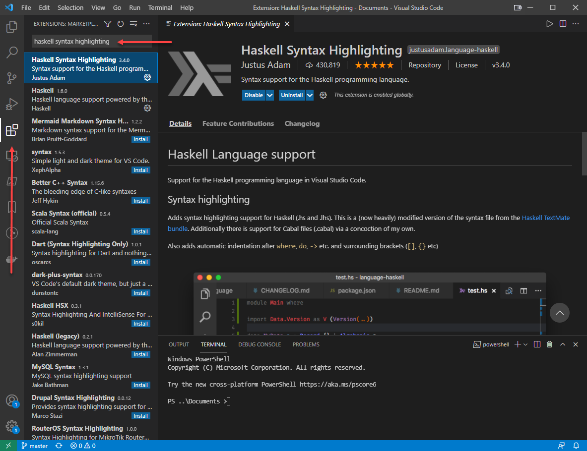

# Installing a Basic Haskell Development Environment

## Installing Haskell Binaries

### GHCUP

- Navigate to [https://www.haskell.org/ghcup/](https://www.haskell.org/ghcup/)
- Copy the Terminal command displayed 
  - The displayed command changes based on OS used to access the page.
- (Windows) Execute the command in Powershell
    - Accept the default answers to the questions that come up:
      - `Mys2` toolchain should be installed.
      - `Haskell Language Server` should not be installed.
      - `Stack` should not be installed.
- (*nix) Execute the command in Terminal
    - If the required Build tools are not already installed, the command will not work.
    - (Mac) The command will trigger install of Build tools, which should be installed. The command will then need to be re-run.
    - (Linux) The tools `curl gcc make` need to be installed prior to running the `ghcup` installation command.
    - `Haskell Language Server` should not be installed.
    - `Stack` should not be installed.

- **Pay attention to where the Haskell files are being installed!**

## Checking Binary Installation

- Close and restart Powershell or Terminal
  - Type and execute `ghc --version`.
  - Type and execute `cabal --version`.
  - Type and execute `ghci`.
    - Try executing arithmetic in `ghci`.
    - Type `:quit` to exit `ghci`.
- If the preceding commands functioned, skip to the next section
- If the preceding commands did not function and `ghcup` succesfully installed, the binaries will have to be added to the PATH

## Installing Visual Studio Code

- Navigate to [https://code.visualstudio.com/download](https://code.visualstudio.com/download)
- Download and install the appropriate VSCode package
- Start Visual Studio Code

## Installing VSCode Extensions

- Go to the 'Extensions' view of VSCode
  - Please see [https://code.visualstudio.com/docs/editor/extension-marketplace](https://code.visualstudio.com/docs/editor/extension-marketplace) if there are questions about VSCode extension management.
- Search for 'Haskell Syntax Highlighting' and Install this extension
- Search for 'Code Runner' and Install this extension

## The Final Checks

- Create a new file in VSCode (File -> 'New File') and save it as `test.hs`
- Type:
  - ```
    module Test where

    main :: IO ()
    main = putStrLn "Hello World"
    ```
- Right Click/Context Click and select 'Run Code'
- A Terminal should appear and execute the above code with a return of "Hello World"

# Notes

- Lorem

## Optional

- Lorem

